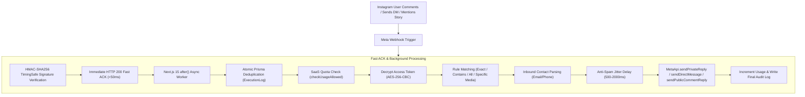

# AutoDMs — Core Backend Architecture & Source Code Audit

> **Product**: AutoDMs (Instagram Comment-to-DM SaaS Automation)  
> **Target Environment**: Next.js 15 (App Router), Vercel Serverless Functions, Supabase PostgreSQL, Prisma ORM, Meta Graph API v24.0  
> **Generated Date**: August 2026  

---

## Table of Contents
1. [Architecture Overview & Workflow Pipeline](#1-architecture-overview--workflow-pipeline)
2. [`src/app/api/webhook/instagram/route.ts` — Webhook Intake & Dispatch Loop](#2-srcappapiwebhookinstagramroutets)
3. [`src/lib/meta.ts` — Meta Graph API Client, Token Debugger & Error Handling](#3-srclibmetats)
4. [`src/lib/tokenRefresh.ts` — 60-Day Token Lifecycle & Auto-Refresh](#4-srclibtokenrefreshts)
5. [`src/lib/crypto.ts` — AES-256-CBC Encryption & Decryption Engine](#5-srclibcryptots)
6. [`src/app/dashboard/automations/actions.ts` — Automations Server Actions](#6-srcappdashboardautomationsactionsts)
7. [`src/lib/plans.ts` — SaaS Quota & Tier Definitions](#7-srclibplansts)
8. [`prisma/schema.prisma` — Database Schema & Performance Indexes](#8-prismaschemaprisma)
9. [`src/middleware.ts` — Route Protection & Auth Middleware](#9-srcmiddlewarets)
10. [`src/lib/auth.ts` — NextAuth & Google OAuth 2.0 Configuration](#10-srclibauthts)

---

## 1. Architecture Overview & Workflow Pipeline



---

## 2. `src/app/api/webhook/instagram/route.ts`

```typescript
import { NextRequest, NextResponse, after } from "next/server";
import crypto from "crypto";
import { db } from "@/lib/db";
import { decrypt } from "@/lib/crypto";
import { MetaApi, buildMessagePayload } from "@/lib/meta";

const sleep = (ms: number) => new Promise((resolve) => setTimeout(resolve, ms));

/**
 * Text Normalization Helper
 * Strips accents, emojis, punctuation, and lowercases/trims the string
 */
function normalizeText(text: string): string {
  return text
    .toLowerCase()
    .normalize("NFD")
    .replace(/[\u0300-\u036f]/g, "") // strip accents
    .replace(/[^\w\s]/gi, "")        // strip emojis/punctuation/special characters
    .replace(/\s+/g, " ")            // normalize whitespace
    .trim();
}

/**
 * SaaS Quota Check Helper
 */
async function checkUsageAllowed(userId: string): Promise<{ allowed: boolean; current?: number; limit?: number }> {
  try {
    const user = await db.user.findUnique({ where: { id: userId } });
    if (!user) return { allowed: true };

    const oneMonth = 30 * 24 * 60 * 60 * 1000;
    if (Date.now() - new Date(user.usageResetAt).getTime() > oneMonth) {
      const updated = await db.user.update({
        where: { id: userId },
        data: {
          dmsCountThisMonth: 0,
          usageResetAt: new Date(),
        },
      });
      return { allowed: true, current: 0, limit: updated.dmsLimit };
    }

    if (user.dmsCountThisMonth >= user.dmsLimit) {
      return { allowed: false, current: user.dmsCountThisMonth, limit: user.dmsLimit };
    }

    return { allowed: true, current: user.dmsCountThisMonth, limit: user.dmsLimit };
  } catch (err) {
    console.error("[Usage Check Error]", err);
    return { allowed: true };
  }
}

/**
 * Increment SaaS Quota Helper
 */
async function incrementUsage(userId: string) {
  try {
    await db.user.update({
      where: { id: userId },
      data: {
        dmsCountThisMonth: { increment: 1 },
      },
    });
  } catch (err) {
    console.error("[Usage Increment Error]", err);
  }
}

/**
 * Background processor for incoming Meta webhook payloads
 */
async function processWebhookPayload(payload: any) {
  if (payload.object !== "instagram") {
    return;
  }

  const entries = payload.entry || [];

  for (const entry of entries) {
    const instagramAccountId = entry.id; // Instagram Business Account ID

    // ==========================================
    // A. PROCESS COMMENT EVENTS
    // ==========================================
    const changes = entry.changes || [];
    for (const change of changes) {
      if (change.field === "comments" && change.value) {
        const commentVal = change.value;
        const commentId = commentVal.id;
        const commentText = commentVal.text;
        const commenterUsername = commentVal.from?.username;
        const mediaId = commentVal.media?.id; // Extract Instagram media ID

        if (!commentId || !commentText || !commenterUsername) {
          continue;
        }

        console.log(`[Webhook Comments] Processing comment ${commentId} ("${commentText}") on media ${mediaId || "unknown"}`);

        // 1. Graceful Atomic Deduplication
        try {
          await db.executionLog.create({
            data: {
              commentId,
              commentText,
              commenterUsername,
              triggerSource: "COMMENT",
              dmStatus: "PROCESSING",
              commentStatus: "PROCESSING",
            },
          });
        } catch (err: any) {
          if (err.code === "P2002" || err.message?.includes("Unique constraint")) {
            console.log(`[Webhook Comments] Duplicate comment skipped (atomic check): ${commentId}`);
            continue;
          }
          console.error(`[Webhook Comments] Deduplication error:`, err);
          continue;
        }

        try {
          // 2. Fetch linked Instagram Account strictly to prevent cross-tenant leaks
          let igAccount = await db.igAccount.findFirst({
            where: {
              OR: [
                { instagramAccountId: String(instagramAccountId) },
                { pageId: String(instagramAccountId) },
              ],
            },
          });

          // Only allow fallback for local development test events with ID "0"
          if (!igAccount && process.env.NODE_ENV !== "production" && (instagramAccountId === "0" || String(instagramAccountId) === "0")) {
            console.log(`[Webhook Comments Dev Fallback] Test event detected (ID 0). Falling back to first database account.`);
            igAccount = await db.igAccount.findFirst();
          }

          if (!igAccount) {
            console.warn(`[Webhook Comments] Account ${instagramAccountId} not linked in database. Skipping event to prevent cross-tenant leaks.`);
            await db.executionLog.update({
              where: { commentId },
              data: {
                dmStatus: "SKIPPED",
                dmError: `Account ${instagramAccountId} not linked in database`,
                commentStatus: "SKIPPED",
                commentError: `Account ${instagramAccountId} not linked in database`,
              },
            });
            continue;
          }

          // Check SaaS Quota Limits
          const quota = await checkUsageAllowed(igAccount.userId);
          if (!quota.allowed) {
            console.warn(`[Webhook Comments] DM Quota Exceeded for user ${igAccount.userId}. Current: ${quota.current}/${quota.limit}`);
            await db.executionLog.update({
              where: { commentId },
              data: {
                dmStatus: "FAILED",
                dmError: `Quota limit exceeded (${quota.current}/${quota.limit})`,
                commentStatus: "SKIPPED",
              },
            });
            continue;
          }

          // Decrypt access token
          let decryptedToken = "";
          try {
            decryptedToken = decrypt(igAccount.accessToken);
          } catch (err: any) {
            console.error(`[Webhook Comments] Failed to decrypt access token for account ${igAccount.instagramAccountId}:`, err);
            await db.executionLog.update({
              where: { commentId },
              data: {
                dmStatus: "FAILED",
                dmError: "Failed to decrypt token: " + err.message,
                commentStatus: "FAILED",
                commentError: "Failed to decrypt token: " + err.message,
              },
            });
            continue;
          }

          // 3. Match rules (COMMENTS or ALL)
          const automations = await db.automation.findMany({
            where: {
              userId: igAccount.userId,
              active: true,
              triggerSource: { in: ["COMMENTS", "ALL"] },
            },
          });

          let matchedAutomation = null;
          const normalizedComment = normalizeText(commentText);

          for (const auto of automations) {
            // Post-Specific Targeting check
            if (auto.triggerScope === "SPECIFIC_POSTS") {
              if (!mediaId || !auto.targetMediaIds.includes(mediaId)) {
                continue;
              }
            }

            const triggerType = auto.triggerType.toUpperCase();

            if (triggerType === "ALL") {
              matchedAutomation = auto;
              break;
            }

            const targetKeywords = auto.triggerKeyword
              ? auto.triggerKeyword.split(",").map((k) => normalizeText(k)).filter((k) => k.length > 0)
              : [];

            if (targetKeywords.length === 0) {
              continue;
            }

            if (triggerType === "EXACT") {
              if (targetKeywords.includes(normalizedComment)) {
                matchedAutomation = auto;
                break;
              }
            } else if (triggerType === "KEYWORD") {
              if (targetKeywords.some((k) => normalizedComment.includes(k))) {
                matchedAutomation = auto;
                break;
              }
            }
          }

          if (!matchedAutomation) {
            console.log(`[Webhook Comments] No active automation rule matched comment text.`);
            const isTest = instagramAccountId === "0" || commenterUsername === "instagram";
            await db.executionLog.update({
              where: { commentId },
              data: {
                dmStatus: isTest ? "TEST_EVENT" : "SKIPPED",
                dmError: "No matching automation trigger",
                commentStatus: isTest ? "TEST_EVENT" : "SKIPPED",
                commentError: "No matching automation trigger",
              },
            });
            continue;
          }

          console.log(`[Webhook Comments] Matched automation "${matchedAutomation.name}"`);

          // 4. Execute Actions with Anti-Spam Jitter Pacing
          let dmStatus = "SKIPPED";
          let dmError: string | null = null;
          let commentStatus = "SKIPPED";
          let commentError: string | null = null;

          // A. Send Private Reply (DM)
          try {
            await sleep(Math.floor(Math.random() * 1500) + 500);
            console.log("Dispatching DM for comment:", commentId);

            const dmPayload = buildMessagePayload(matchedAutomation, commenterUsername || "there");
            const dmResult = await MetaApi.sendPrivateReply(commentId, dmPayload, decryptedToken);

            dmStatus = dmResult.status;
            dmError = dmResult.error || null;

            if (dmResult.status === "SUCCESS") {
              await incrementUsage(igAccount.userId);
            }
          } catch (err: any) {
            console.error("[Webhook Comments] Failed to dispatch DM:", err);
            dmStatus = "FAILED";
            dmError = err.message || "Failed to dispatch DM";
          }

          // B. Send Public Comment Reply (Randomized option if configured)
          if (
            matchedAutomation.replyCommentOptions &&
            matchedAutomation.replyCommentOptions.length > 0
          ) {
            const options = matchedAutomation.replyCommentOptions;
            const chosenPublicReply = options[Math.floor(Math.random() * options.length)];

            try {
              await sleep(Math.floor(Math.random() * 1500) + 500);
              console.log(`[Webhook Comments] Dispatching Public Reply to comment ${commentId}...`);

              const replyResult = await MetaApi.sendPublicCommentReply(commentId, chosenPublicReply, decryptedToken);
              commentStatus = replyResult.status;
              commentError = replyResult.error || null;
            } catch (err: any) {
              console.error("[Webhook Comments] Failed to dispatch public reply:", err);
              commentStatus = "FAILED";
              commentError = err.message || "Failed to dispatch public reply";
            }
          }

          // 5. Update execution log with final outcomes
          await db.executionLog.update({
            where: { commentId },
            data: {
              automationId: matchedAutomation.id,
              dmStatus,
              dmError,
              commentStatus,
              commentError,
            },
          });
        } catch (err: any) {
          console.error(`[Webhook Comments] Error executing comment automation:`, err);
          try {
            await db.executionLog.update({
              where: { commentId },
              data: {
                dmStatus: "FAILED",
                dmError: err.message || "Unknown execution crash",
                commentStatus: "FAILED",
                commentError: err.message || "Unknown execution crash",
              },
            });
          } catch (logErr) {
            console.error("Could not write update execution log:", logErr);
          }
        }
      }
    }

    // ==========================================
    // B. PROCESS DIRECT MESSAGES, STORIES, AND POSTBACKS
    // ==========================================
    const messaging = entry.messaging || [];
    for (const msgEvent of messaging) {
      const senderId = msgEvent.sender?.id;
      const message = msgEvent.message;
      const postback = msgEvent.postback;

      if (!senderId || (!message && !postback)) {
        continue;
      }

      const messageText = message ? (message.text || "") : (postback.payload || postback.title || "");
      const messageId = message ? (message.mid || "") : ("postback_" + msgEvent.timestamp + "_" + senderId);

      if (!messageId) {
        continue;
      }

      console.log(`[Webhook Messaging] Processing messaging event ${messageId} (Postback: ${!!postback}) from sender ${senderId}`);

      // 1. Graceful Atomic Deduplication
      try {
        await db.executionLog.create({
          data: {
            commentId: messageId,
            commentText: messageText || "[Media/Postback/Attachment]",
            commenterUsername: "ig_user_" + senderId,
            triggerSource: "DIRECT_MESSAGE",
            dmStatus: "PROCESSING",
            commentStatus: "SKIPPED",
          },
        });
      } catch (err: any) {
        if (err.code === "P2002" || err.message?.includes("Unique constraint")) {
          console.log(`[Webhook Messaging] Duplicate message skipped (atomic check): ${messageId}`);
          continue;
        }
        console.error(`[Webhook Messaging] Deduplication error:`, err);
        continue;
      }

      try {
        // 2. Fetch linked Instagram Account strictly to prevent cross-tenant leaks
        let igAccount = await db.igAccount.findFirst({
          where: {
            OR: [
              { instagramAccountId: String(instagramAccountId) },
              { pageId: String(instagramAccountId) },
            ],
          },
        });

        // Only allow fallback for local development test events with ID "0"
        if (!igAccount && process.env.NODE_ENV !== "production" && (instagramAccountId === "0" || String(instagramAccountId) === "0")) {
          console.log(`[Webhook Messaging Dev Fallback] Test event detected (ID 0). Falling back to first database account.`);
          igAccount = await db.igAccount.findFirst();
        }

        if (!igAccount) {
          console.warn(`[Webhook Messaging] Account ${instagramAccountId} not linked in database. Skipping event to prevent cross-tenant leaks.`);
          await db.executionLog.update({
            where: { commentId: messageId },
            data: {
              dmStatus: "SKIPPED",
              dmError: `Account ${instagramAccountId} not linked in database`,
            },
          });
          continue;
        }

        // Check SaaS Quota Limits
        const quota = await checkUsageAllowed(igAccount.userId);
        if (!quota.allowed) {
          console.warn(`[Webhook Messaging] DM Quota Exceeded for user ${igAccount.userId}. Current: ${quota.current}/${quota.limit}`);
          await db.executionLog.update({
            where: { commentId: messageId },
            data: {
              dmStatus: "FAILED",
              dmError: `Quota limit exceeded (${quota.current}/${quota.limit})`,
            },
          });
          continue;
        }

        // Decrypt access token
        let decryptedToken = "";
        try {
          decryptedToken = decrypt(igAccount.accessToken);
        } catch (err: any) {
          console.error(`[Webhook Messaging] Failed to decrypt access token for account ${igAccount.instagramAccountId}:`, err);
          await db.executionLog.update({
            where: { commentId: messageId },
            data: {
              dmStatus: "FAILED",
              dmError: "Failed to decrypt token: " + err.message,
            },
          });
          continue;
        }

        // 3. Resolve real Instagram username via Meta API
        let resolvedUsername = "there";
        try {
          const profileRes = await fetch(`https://graph.instagram.com/v24.0/${senderId}?fields=username&access_token=${decryptedToken}`);
          if (profileRes.ok) {
            const profileData = await profileRes.json();
            if (profileData.username) {
              resolvedUsername = profileData.username;
            }
          }
        } catch (profErr) {
          console.warn("[Webhook Messaging] Could not resolve sender profile info:", profErr);
        }

        // 3.5 Inbound Email & International/Moroccan Phone Detection for Lead Capture Guard
        const emailMatch = messageText ? messageText.match(/[a-zA-Z0-9._%+-]+@[a-zA-Z0-9.-]+\.[a-zA-Z]{2,}/) : null;
        // Supports Moroccan formats (06..., 07..., +212..., 05...) and global international formats
        const phoneRegex = /(?:(?:\+|00)212[\s.-]?|0)[5-7](?:[\s.-]?\d{2}){4}|(?:\+?\d{1,4}[\s.-]?)?\(?\d{2,4}\)?[\s.-]?\d{3,4}[\s.-]?\d{3,4}/;
        const phoneMatch = messageText ? messageText.match(phoneRegex) : null;

        const email = emailMatch ? emailMatch[0] : null;
        const phone = phoneMatch ? phoneMatch[0] : null;

        if (email || phone) {
          console.log(`[Webhook Lead Capture] Contact details captured from ${senderId}: email=${email}, phone=${phone}`);

          const leadCaptureAuto = await db.automation.findFirst({
            where: {
              userId: igAccount.userId,
              active: true,
              enableLeadCapture: true,
            },
          });

          // Upsert Lead using @@unique([igAccountId, instagramId])
          await db.lead.upsert({
            where: {
              igAccountId_instagramId: {
                igAccountId: igAccount.id,
                instagramId: senderId,
              },
            },
            update: {
              username: resolvedUsername,
              email: email || undefined,
              phone: phone || undefined,
              automationId: leadCaptureAuto?.id || undefined,
            },
            create: {
              igAccountId: igAccount.id,
              instagramId: senderId,
              username: resolvedUsername,
              email,
              phone,
              automationId: leadCaptureAuto?.id || null,
            },
          });

          // Update execution log
          await db.executionLog.update({
            where: { commentId: messageId },
            data: {
              triggerSource: "DIRECT_MESSAGE",
              commenterUsername: resolvedUsername,
              automationId: leadCaptureAuto?.id || null,
              dmStatus: "LEAD_CAPTURED",
            },
          });

          // Send Lead Confirmation DM if configured
          if (leadCaptureAuto && leadCaptureAuto.leadConfirmationDm) {
            const quotaCheck = await checkUsageAllowed(igAccount.userId);
            if (quotaCheck.allowed) {
              try {
                await sleep(Math.floor(Math.random() * 1500) + 500);
                const dmText = leadCaptureAuto.leadConfirmationDm.replace(/\{\{username\}\}/g, resolvedUsername);

                const confirmationResult = await MetaApi.sendDirectMessage(senderId, { text: dmText }, decryptedToken);

                if (confirmationResult.status === "SUCCESS") {
                  await incrementUsage(igAccount.userId);
                }
              } catch (dmErr) {
                console.error("[Webhook Lead Capture] Failed to send DM confirmation:", dmErr);
              }
            }
          }

          continue; // Lead successfully handled; skip subsequent keyword rules
        }

        // Check if Story Mention
        const isStoryMention = message?.attachments?.some(
          (att: any) => att.type === "story_mention" || att.type === "ig_story_mention"
        ) || false;

        let matchedAutomation = null;
        let triggerSourceField = "DIRECT_MESSAGE";

        if (isStoryMention) {
          triggerSourceField = "STORY_MENTION";
          const automations = await db.automation.findMany({
            where: {
              userId: igAccount.userId,
              active: true,
              triggerSource: { in: ["STORY_MENTIONS", "ALL"] },
            },
          });

          if (automations.length > 0) {
            matchedAutomation = automations[0];
          }
        } else if (messageText) {
          triggerSourceField = "DIRECT_MESSAGE";
          const automations = await db.automation.findMany({
            where: {
              userId: igAccount.userId,
              active: true,
              triggerSource: { in: ["DIRECT_MESSAGES", "ALL"] },
            },
          });

          const normalizedMsg = normalizeText(messageText);

          for (const auto of automations) {
            const triggerType = auto.triggerType.toUpperCase();

            if (triggerType === "ALL") {
              matchedAutomation = auto;
              break;
            }

            const targetKeywords = auto.triggerKeyword
              ? auto.triggerKeyword.split(",").map((k) => normalizeText(k)).filter((k) => k.length > 0)
              : [];

            if (targetKeywords.length === 0) {
              continue;
            }

            if (triggerType === "EXACT") {
              if (targetKeywords.includes(normalizedMsg)) {
                matchedAutomation = auto;
                break;
              }
            } else if (triggerType === "KEYWORD") {
              if (targetKeywords.some((k) => normalizedMsg.includes(k))) {
                matchedAutomation = auto;
                break;
              }
            }
          }
        }

        // Update triggerSource and resolvedUsername in Log
        await db.executionLog.update({
          where: { commentId: messageId },
          data: {
            triggerSource: triggerSourceField,
            commenterUsername: resolvedUsername,
          },
        });

        if (!matchedAutomation) {
          console.log(`[Webhook Messaging] No active automation rule matched DM/Story Mention.`);
          await db.executionLog.update({
            where: { commentId: messageId },
            data: {
              dmStatus: "SKIPPED",
              dmError: "No matching automation trigger",
            },
          });
          continue;
        }

        console.log(`[Webhook Messaging] Matched automation "${matchedAutomation.name}"`);

        // 4. Execute Direct Message Reply
        let dmStatus = "SKIPPED";
        let dmError: string | null = null;

        try {
          await sleep(Math.floor(Math.random() * 1500) + 500);
          console.log("Dispatching Direct Message to user:", senderId);

          const dmPayload = buildMessagePayload(matchedAutomation, resolvedUsername);
          const dmResult = await MetaApi.sendDirectMessage(senderId, dmPayload, decryptedToken);

          dmStatus = dmResult.status;
          dmError = dmResult.error || null;

          if (dmResult.status === "SUCCESS") {
            await incrementUsage(igAccount.userId);
          }
        } catch (err: any) {
          console.error("[Webhook Messaging] Failed to dispatch DM:", err);
          dmStatus = "FAILED";
          dmError = err.message || "Failed to dispatch DM";
        }

        // 5. Update execution log with outcomes
        await db.executionLog.update({
          where: { commentId: messageId },
          data: {
            automationId: matchedAutomation.id,
            dmStatus,
            dmError,
          },
        });
      } catch (err: any) {
        console.error(`[Webhook Messaging] Error executing messaging automation:`, err);
        try {
          await db.executionLog.update({
            where: { commentId: messageId },
            data: {
              dmStatus: "FAILED",
              dmError: err.message || "Unknown execution crash",
            },
          });
        } catch (logErr) {
          console.error("Could not write update execution log:", logErr);
        }
      }
    }
  }
}

/**
 * GET Handler: Meta Webhook Subscription Verification Handshake
 */
export async function GET(request: NextRequest) {
  const { searchParams } = new URL(request.url);
  const mode = searchParams.get("hub.mode");
  const token = searchParams.get("hub.verify_token");
  const challenge = searchParams.get("hub.challenge");

  const verifyToken = process.env.META_WEBHOOK_VERIFY_TOKEN;

  if (mode === "subscribe" && token === verifyToken) {
    console.log("[Webhook] Verification successful.");
    return new NextResponse(challenge, { status: 200 });
  }

  console.error("[Webhook] Verification failed. Token mismatch.");
  return new NextResponse("Forbidden", { status: 403 });
}

/**
 * POST Handler: Handles incoming real-time events from Meta/Instagram
 * Uses Next.js 15 after() for immediate Fast ACK (<50ms) to Meta servers
 */
export async function POST(request: NextRequest) {
  const signature = request.headers.get("X-Hub-Signature-256") || request.headers.get("x-hub-signature-256");

  if (!signature) {
    console.error("[Webhook] Signature verification failed: X-Hub-Signature-256 header missing.");
    return new NextResponse("Unauthorized: Signature missing", { status: 401 });
  }

  const parts = signature.split("=");
  if (parts.length !== 2 || parts[0] !== "sha256") {
    console.error("[Webhook] Signature verification failed: Invalid signature format.");
    return new NextResponse("Bad Request: Invalid signature format", { status: 400 });
  }

  const signatureHash = parts[1];
  const rawBody = await request.text();
  const appSecret = process.env.META_APP_SECRET || process.env.INSTAGRAM_APP_SECRET;

  if (!appSecret) {
    console.error("[Webhook] Configuration error: META_APP_SECRET or INSTAGRAM_APP_SECRET is not configured.");
    return new NextResponse("Server configuration error: missing App Secret", { status: 500 });
  }

  // Verify HMAC-SHA256 signature using timingSafeEqual
  const expectedHash = crypto
    .createHmac("sha256", appSecret)
    .update(rawBody)
    .digest("hex");

  const signatureBuffer = Buffer.from(signatureHash, "utf8");
  const expectedBuffer = Buffer.from(expectedHash, "utf8");

  const isMatching =
    signatureBuffer.length === expectedBuffer.length &&
    crypto.timingSafeEqual(signatureBuffer, expectedBuffer);

  if (!isMatching) {
    console.error("[Webhook] Signature verification failed: Signature mismatch.");
    if (process.env.NODE_ENV === "production") {
      return new NextResponse("Unauthorized: Signature mismatch", { status: 401 });
    } else {
      console.warn("[Webhook] Development mode: proceeding despite signature mismatch...");
    }
  }

  let payload: any;
  try {
    payload = JSON.parse(rawBody);
  } catch (jsonErr) {
    console.error("[Webhook] JSON parse failed:", jsonErr);
    return new NextResponse("Bad Request: Invalid JSON", { status: 400 });
  }

  // Fast ACK: Schedule background execution via Next.js 15 after()
  after(async () => {
    try {
      await processWebhookPayload(payload);
    } catch (bgErr) {
      console.error("[Webhook Background Worker Crash]:", bgErr);
    }
  });

  // Immediately respond to Meta to prevent timeout / retry storms
  return new Response("EVENT_RECEIVED", { status: 200 });
}
```

---

## 3. `src/lib/meta.ts`

```typescript
const META_API_VERSION = process.env.META_API_VERSION || "v24.0";
const META_API_URL = `https://graph.facebook.com/${META_API_VERSION}`;
const INSTAGRAM_API_URL = `https://graph.instagram.com/${META_API_VERSION}`;

export class MetaTokenExpiredError extends Error {
  public code: number;
  constructor(message: string, code = 190) {
    super(message);
    this.name = "MetaTokenExpiredError";
    this.code = code;
  }
}

export class MetaRateLimitError extends Error {
  public code: number;
  constructor(message: string, code: number) {
    super(message);
    this.name = "MetaRateLimitError";
    this.code = code;
  }
}

export interface MetaDispatchResult {
  success: boolean;
  messageId?: string;
  commentId?: string;
  status: "SUCCESS" | "FAILED" | "SKIPPED";
  reason?: string;
  error?: string;
  errorCode?: number;
}

interface ExchangeTokenResponse {
  access_token: string;
  token_type: string;
  expires_in?: number;
}

interface FacebookPage {
  id: string;
  name: string;
  access_token: string;
  tasks: string[];
}

interface IgBusinessAccount {
  id: string;
  username?: string;
  name?: string;
}

/**
 * Validates and sanitizes a button URL. Returns null if not valid https:// or http:// link.
 */
export function sanitizeButtonUrl(url: string | null | undefined): string | null {
  if (!url) return null;
  const trimmed = url.trim();
  try {
    const parsed = new URL(trimmed);
    if (parsed.protocol === "https:" || parsed.protocol === "http:") {
      return trimmed;
    }
    return null;
  } catch {
    return null;
  }
}

/**
 * Truncates and sanitizes button title to maximum 20 characters (Meta Generic Template limit)
 */
export function sanitizeButtonTitle(title: string | null | undefined): string {
  if (!title) return "";
  return title.trim().slice(0, 20);
}

/**
 * Formats a message payload, safely building Generic Template buttons or falling back to text.
 */
export function buildMessagePayload(matchedAutomation: any, resolvedUsername: string): any {
  const dmText = matchedAutomation.replyDmMessage
    ? matchedAutomation.replyDmMessage.replace(/\{\{username\}\}/g, resolvedUsername)
    : "Hello!";

  const primaryTitle = sanitizeButtonTitle(matchedAutomation.buttonTitle);
  const primaryUrl = sanitizeButtonUrl(matchedAutomation.buttonUrl);

  if (primaryTitle && primaryUrl) {
    const buttons: any[] = [
      {
        type: "web_url",
        url: primaryUrl,
        title: primaryTitle,
      }
    ];

    const secondaryTitle = sanitizeButtonTitle(matchedAutomation.secondaryButtonTitle);
    const secondaryUrl = sanitizeButtonUrl(matchedAutomation.secondaryButtonUrl);
    if (secondaryTitle && secondaryUrl) {
      buttons.push({
        type: "web_url",
        url: secondaryUrl,
        title: secondaryTitle,
      });
    }

    return {
      attachment: {
        type: "template",
        payload: {
          template_type: "generic",
          elements: [
            {
              title: (matchedAutomation.name || "AutoDMs").slice(0, 80),
              subtitle: dmText.slice(0, 80),
              buttons: buttons,
            }
          ]
        }
      }
    };
  }

  // Fallback to clean plain-text message
  return { text: dmText };
}

/**
 * Helper to parse Meta Graph API errors
 */
function parseMetaError(data: any): {
  isTokenExpired: boolean;
  is24hWindow: boolean;
  isRateLimit: boolean;
  errorCode?: number;
  errorMessage: string;
} {
  const errorObj = data?.error || {};
  const code = typeof errorObj.code === "number" ? errorObj.code : undefined;
  const subcode = typeof errorObj.error_subcode === "number" ? errorObj.error_subcode : undefined;
  const rawMsg = errorObj.message || (typeof data === "string" ? data : JSON.stringify(data));
  const msgLower = String(rawMsg).toLowerCase();

  const isTokenExpired =
    code === 190 ||
    code === 10 ||
    msgLower.includes("session has expired") ||
    msgLower.includes("invalid oauth access token");

  const is24hWindow =
    code === 551 ||
    subcode === 2534037 ||
    msgLower.includes("24 hour") ||
    msgLower.includes("24-hour") ||
    msgLower.includes("not available right now") ||
    msgLower.includes("outside of the permitted window") ||
    msgLower.includes("cannot message this user");

  const isRateLimit =
    code === 4 ||
    code === 17 ||
    code === 32 ||
    code === 613 ||
    msgLower.includes("rate limit") ||
    msgLower.includes("too many calls");

  return {
    isTokenExpired,
    is24hWindow,
    isRateLimit,
    errorCode: code,
    errorMessage: rawMsg,
  };
}

export class MetaApi {
  /**
   * Exchange short-lived Facebook User Access Token for long-lived User Access Token
   */
  static async getLongLivedUserAccessToken(shortLivedToken: string): Promise<string> {
    const appId = process.env.META_APP_ID || process.env.INSTAGRAM_APP_ID;
    const appSecret = process.env.META_APP_SECRET || process.env.INSTAGRAM_APP_SECRET;

    if (!appId || !appSecret) {
      throw new Error("META_APP_ID and META_APP_SECRET must be configured");
    }

    const url = `${META_API_URL}/oauth/access_token?grant_type=fb_exchange_token&client_id=${appId}&client_secret=${appSecret}&fb_exchange_token=${shortLivedToken}`;

    const res = await fetch(url);
    if (!res.ok) {
      const errorText = await res.text();
      throw new Error(`Failed to exchange token: ${errorText}`);
    }

    const data = (await res.json()) as ExchangeTokenResponse;
    return data.access_token;
  }

  /**
   * Fetch Pages managed by the user using the long-lived User Access Token.
   * Page tokens returned from this call are also long-lived.
   */
  static async getUserPages(longLivedUserToken: string): Promise<FacebookPage[]> {
    const url = `${META_API_URL}/me/accounts?fields=id,name,access_token,tasks&limit=100&access_token=${longLivedUserToken}`;

    const res = await fetch(url);
    if (!res.ok) {
      const errorText = await res.text();
      throw new Error(`Failed to fetch pages: ${errorText}`);
    }

    const data = await res.json();
    return (data.data || []) as FacebookPage[];
  }

  /**
   * Fetch the connected Instagram Business Account ID and details for a given Facebook Page.
   */
  static async getInstagramBusinessAccount(pageId: string, pageAccessToken: string): Promise<IgBusinessAccount | null> {
    const url = `${META_API_URL}/${pageId}?fields=instagram_business_account&access_token=${pageAccessToken}`;

    const res = await fetch(url);
    if (!res.ok) {
      const errorText = await res.text();
      console.error(`Failed to get Instagram Business Account for Page ${pageId}:`, errorText);
      return null;
    }

    const data = await res.json();
    if (!data.instagram_business_account) {
      return null;
    }

    const igId = data.instagram_business_account.id;

    // Fetch details like username and name for the Instagram account
    const detailUrl = `${META_API_URL}/${igId}?fields=username,name&access_token=${pageAccessToken}`;
    const detailRes = await fetch(detailUrl);
    if (detailRes.ok) {
      const detailData = await detailRes.json();
      return {
        id: igId,
        username: detailData.username,
        name: detailData.name,
      };
    }

    return { id: igId };
  }

  /**
   * Subscribe Facebook Page to the Webhook App
   */
  static async subscribePageToWebhook(pageId: string, pageAccessToken: string): Promise<boolean> {
    const url = `${META_API_URL}/${pageId}/subscribed_apps`;
    const res = await fetch(url, {
      method: "POST",
      headers: {
        "Content-Type": "application/json",
      },
      body: JSON.stringify({
        subscribed_fields: "feed,messages,mention,comments",
        access_token: pageAccessToken,
      }),
    });

    if (!res.ok) {
      const errorText = await res.text();
      console.error(`Failed to subscribe Page ${pageId} to app:`, errorText);
      return false;
    }

    const data = await res.json();
    return data.success === true;
  }

  /**
   * Debugs and inspects access token validity, scopes, and expiration with Meta API
   */
  static async debugToken(inputToken: string, appAccessToken?: string): Promise<any> {
    const appId = process.env.META_APP_ID || process.env.INSTAGRAM_APP_ID;
    const appSecret = process.env.META_APP_SECRET || process.env.INSTAGRAM_APP_SECRET;
    const token = appAccessToken || (appId && appSecret ? `${appId}|${appSecret}` : inputToken);
    const url = `${META_API_URL}/debug_token?input_token=${inputToken}&access_token=${token}`;
    const res = await fetch(url);
    return await res.json();
  }

  /**
   * Send Private Reply (DM) to an Instagram Comment with error boundaries
   */
  static async sendPrivateReply(
    commentId: string,
    messagePayload: any,
    pageAccessToken: string
  ): Promise<MetaDispatchResult> {
    const url = `${INSTAGRAM_API_URL}/me/messages`;

    const payload = typeof messagePayload === "string" ? { text: messagePayload } : messagePayload;

    try {
      const res = await fetch(url, {
        method: "POST",
        headers: {
          Authorization: `Bearer ${pageAccessToken}`,
          "Content-Type": "application/json",
        },
        body: JSON.stringify({
          recipient: {
            comment_id: commentId,
          },
          message: payload,
        }),
      });

      const data = await res.json();

      if (res.ok && !data.error) {
        return {
          success: true,
          status: "SUCCESS",
          messageId: data.message_id || data.id,
        };
      }

      const { isTokenExpired, is24hWindow, isRateLimit, errorCode, errorMessage } = parseMetaError(data);

      if (isTokenExpired) {
        console.error(`[Meta API Token Expired] Code ${errorCode}: ${errorMessage}`);
        return {
          success: false,
          status: "FAILED",
          reason: "META_TOKEN_EXPIRED",
          errorCode: errorCode || 190,
          error: errorMessage,
        };
      }

      if (is24hWindow) {
        console.warn(`[Meta API 24h Window] Outside 24h window for comment ${commentId}: ${errorMessage}`);
        return {
          success: false,
          status: "SKIPPED",
          reason: "USER_UNREACHABLE_24H_WINDOW",
          errorCode: errorCode || 551,
          error: errorMessage,
        };
      }

      if (isRateLimit) {
        console.warn(`[Meta API Rate Limit] Code ${errorCode}: ${errorMessage}`);
        return {
          success: false,
          status: "FAILED",
          reason: "META_RATE_LIMIT",
          errorCode,
          error: errorMessage,
        };
      }

      return {
        success: false,
        status: "FAILED",
        errorCode,
        error: errorMessage,
      };
    } catch (e: any) {
      return {
        success: false,
        status: "FAILED",
        error: e.message || "Unknown network error during private reply dispatch",
      };
    }
  }

  /**
   * Send Direct Message to an Instagram Recipient ID with error boundaries
   */
  static async sendDirectMessage(
    recipientId: string,
    messagePayload: any,
    pageAccessToken: string
  ): Promise<MetaDispatchResult> {
    const url = `${INSTAGRAM_API_URL}/me/messages`;

    const payload = typeof messagePayload === "string" ? { text: messagePayload } : messagePayload;

    try {
      const res = await fetch(url, {
        method: "POST",
        headers: {
          Authorization: `Bearer ${pageAccessToken}`,
          "Content-Type": "application/json",
        },
        body: JSON.stringify({
          recipient: {
            id: recipientId,
          },
          message: payload,
        }),
      });

      const data = await res.json();

      if (res.ok && !data.error) {
        return {
          success: true,
          status: "SUCCESS",
          messageId: data.message_id || data.id,
        };
      }

      const { isTokenExpired, is24hWindow, isRateLimit, errorCode, errorMessage } = parseMetaError(data);

      if (isTokenExpired) {
        console.error(`[Meta API Token Expired] Code ${errorCode}: ${errorMessage}`);
        return {
          success: false,
          status: "FAILED",
          reason: "META_TOKEN_EXPIRED",
          errorCode: errorCode || 190,
          error: errorMessage,
        };
      }

      if (is24hWindow) {
        console.warn(`[Meta API 24h Window] Outside 24h window for user ${recipientId}: ${errorMessage}`);
        return {
          success: false,
          status: "SKIPPED",
          reason: "USER_UNREACHABLE_24H_WINDOW",
          errorCode: errorCode || 551,
          error: errorMessage,
        };
      }

      if (isRateLimit) {
        console.warn(`[Meta API Rate Limit] Code ${errorCode}: ${errorMessage}`);
        return {
          success: false,
          status: "FAILED",
          reason: "META_RATE_LIMIT",
          errorCode,
          error: errorMessage,
        };
      }

      return {
        success: false,
        status: "FAILED",
        errorCode,
        error: errorMessage,
      };
    } catch (e: any) {
      return {
        success: false,
        status: "FAILED",
        error: e.message || "Unknown network error during direct message dispatch",
      };
    }
  }

  /**
   * Post a public reply comment to an Instagram comment with error boundaries
   */
  static async sendPublicCommentReply(
    commentId: string,
    replyText: string,
    pageAccessToken: string
  ): Promise<MetaDispatchResult> {
    const url = `${INSTAGRAM_API_URL}/${commentId}/replies`;

    try {
      const res = await fetch(url, {
        method: "POST",
        headers: {
          Authorization: `Bearer ${pageAccessToken}`,
          "Content-Type": "application/json",
        },
        body: JSON.stringify({
          message: replyText,
        }),
      });

      const data = await res.json();

      if (res.ok && !data.error) {
        return {
          success: true,
          status: "SUCCESS",
          commentId: data.id,
        };
      }

      const { isTokenExpired, isRateLimit, errorCode, errorMessage } = parseMetaError(data);

      if (isTokenExpired) {
        console.error(`[Meta API Token Expired] Code ${errorCode}: ${errorMessage}`);
        return {
          success: false,
          status: "FAILED",
          reason: "META_TOKEN_EXPIRED",
          errorCode: errorCode || 190,
          error: errorMessage,
        };
      }

      if (isRateLimit) {
        console.warn(`[Meta API Rate Limit] Code ${errorCode}: ${errorMessage}`);
        return {
          success: false,
          status: "FAILED",
          reason: "META_RATE_LIMIT",
          errorCode,
          error: errorMessage,
        };
      }

      return {
        success: false,
        status: "FAILED",
        errorCode,
        error: errorMessage,
      };
    } catch (e: any) {
      return {
        success: false,
        status: "FAILED",
        error: e.message || "Unknown error during public comment reply",
      };
    }
  }
}
```

---

## 4. `src/lib/tokenRefresh.ts`

```typescript
import { db } from "@/lib/db";
import { decrypt, encrypt } from "@/lib/crypto";

/**
 * Manually refreshes a long-lived Instagram Page token with Meta API
 */
export async function refreshLongLivedToken(instagramAccountId: string) {
  try {
    const igAccount = await db.igAccount.findFirst({
      where: {
        OR: [
          { instagramAccountId: String(instagramAccountId) },
          { pageId: String(instagramAccountId) }
        ]
      }
    });

    if (!igAccount) {
      throw new Error(`Account with ID ${instagramAccountId} not found in database.`);
    }

    const decryptedToken = decrypt(igAccount.accessToken);
    const refreshUrl = `https://graph.instagram.com/refresh_access_token?grant_type=ig_refresh_token&access_token=${decryptedToken}`;

    console.log(`[Token Refresh] Refreshing token for Instagram Account ${igAccount.pageName}...`);
    const res = await fetch(refreshUrl);
    const data = await res.json();

    if (!res.ok || data.error) {
      throw new Error(data.error?.message || JSON.stringify(data) || "Failed to refresh token with Meta API");
    }

    const newAccessToken = data.access_token;
    const expiresIn = data.expires_in || 5184000; // Default to 60 days
    const tokenExpiresAt = new Date(Date.now() + expiresIn * 1000);
    const encryptedToken = encrypt(newAccessToken);

    await db.igAccount.update({
      where: { id: igAccount.id },
      data: {
        accessToken: encryptedToken,
        tokenExpiresAt,
      },
    });

    console.log(`[Token Refresh] Token refreshed successfully for @${igAccount.pageName}. Expires at: ${tokenExpiresAt}`);
    return { success: true, tokenExpiresAt };
  } catch (err: any) {
    console.error(`[Token Refresh Failed] for ${instagramAccountId}:`, err);
    return { success: false, error: err.message || String(err) };
  }
}

/**
 * Automatically triggers token refresh if expiry date is null or within 20 days
 */
export async function refreshLongLivedTokenIfNeeded(igAccount: {
  instagramAccountId: string;
  tokenExpiresAt: Date | null;
}) {
  const now = new Date();
  const thresholdDays = 20;
  const thresholdMs = thresholdDays * 24 * 60 * 60 * 1000;

  let shouldRefresh = false;

  if (!igAccount.tokenExpiresAt) {
    shouldRefresh = true;
  } else {
    const timeUntilExpiry = new Date(igAccount.tokenExpiresAt).getTime() - now.getTime();
    if (timeUntilExpiry < thresholdMs) {
      shouldRefresh = true;
    }
  }

  if (shouldRefresh) {
    console.log(`[Token Auto-Refresh] Token for ${igAccount.instagramAccountId} is expiring within ${thresholdDays} days or null. refreshing...`);
    return await refreshLongLivedToken(igAccount.instagramAccountId);
  }

  return { success: true, skipped: true };
}
```

---

## 5. `src/lib/crypto.ts`

```typescript
import crypto from "crypto";

const ALGORITHM = "aes-256-cbc";
const ENCRYPTION_KEY = process.env.ENCRYPTION_KEY || ""; // Must be 32 characters

export function encrypt(text: string): string {
  if (!text) return "";
  if (ENCRYPTION_KEY.length !== 32) {
    throw new Error("ENCRYPTION_KEY must be exactly 32 characters long. Current length: " + ENCRYPTION_KEY.length);
  }
  const iv = crypto.randomBytes(16);
  const cipher = crypto.createCipheriv(ALGORITHM, Buffer.from(ENCRYPTION_KEY), iv);
  let encrypted = cipher.update(text, "utf8", "hex");
  encrypted += cipher.final("hex");
  return `${iv.toString("hex")}:${encrypted}`;
}

export function decrypt(encryptedText: string): string {
  if (!encryptedText) return "";
  if (ENCRYPTION_KEY.length !== 32) {
    throw new Error("ENCRYPTION_KEY must be exactly 32 characters long. Current length: " + ENCRYPTION_KEY.length);
  }
  const parts = encryptedText.split(":");
  if (parts.length !== 2) {
    throw new Error("Invalid encrypted text format. Missing IV separator.");
  }
  const iv = Buffer.from(parts[0], "hex");
  const encrypted = parts[1];
  const decipher = crypto.createDecipheriv(ALGORITHM, Buffer.from(ENCRYPTION_KEY), iv);
  let decrypted = decipher.update(encrypted, "hex", "utf8");
  decrypted += decipher.final("utf8");
  return decrypted;
}
```

---

## 6. `src/app/dashboard/automations/actions.ts`

```typescript
"use server";

import { revalidatePath } from "next/cache";
import { db } from "@/lib/db";
import { getServerSession } from "next-auth";
import { authOptions } from "@/lib/auth";

export async function createAutomation(formData: FormData) {
  const session = await getServerSession(authOptions);
  if (!session?.user?.id) {
    throw new Error("Unauthorized");
  }
  const userId = session.user.id;

  const name = formData.get("name") as string;
  const triggerType = formData.get("triggerType") as string;
  const triggerKeyword = formData.get("triggerKeyword") as string;
  const replyDmMessage = formData.get("replyDmMessage") as string;
  const replyCommentRaw = formData.get("replyCommentOptions") as string;
  const triggerScope = (formData.get("triggerScope") as string) || "ALL_POSTS";
  const targetMediaIdsRaw = formData.get("targetMediaIds") as string;
  const triggerSource = (formData.get("triggerSource") as string) || "COMMENTS";
  const enableLeadCapture = formData.get("enableLeadCapture") === "true";
  const leadConfirmationDm = formData.get("leadConfirmationDm") as string;

  const buttonTitle = formData.get("buttonTitle") as string;
  const buttonUrl = formData.get("buttonUrl") as string;
  const secondaryButtonTitle = formData.get("secondaryButtonTitle") as string;
  const secondaryButtonUrl = formData.get("secondaryButtonUrl") as string;

  if (!name || !triggerType || !replyDmMessage) {
    throw new Error("Please fill in all required fields.");
  }

  // Parse public comment options by line
  const replyCommentOptions = replyCommentRaw
    ? replyCommentRaw
        .split("\n")
        .map((opt) => opt.trim())
        .filter((opt) => opt.length > 0)
    : [];

  const targetMediaIds = targetMediaIdsRaw
    ? targetMediaIdsRaw
        .split(",")
        .map((id) => id.trim())
        .filter((id) => id.length > 0)
    : [];

  await db.automation.create({
    data: {
      userId,
      name,
      triggerType,
      triggerKeyword: triggerType === "ALL" ? null : triggerKeyword,
      replyDmMessage,
      replyCommentOptions,
      triggerScope,
      targetMediaIds,
      triggerSource,
      enableLeadCapture,
      leadConfirmationDm: enableLeadCapture ? leadConfirmationDm : null,
      buttonTitle: buttonTitle || null,
      buttonUrl: buttonUrl || null,
      secondaryButtonTitle: secondaryButtonTitle || null,
      secondaryButtonUrl: secondaryButtonUrl || null,
      active: true,
    },
  });

  revalidatePath("/dashboard/automations");
  revalidatePath("/dashboard");
}

export async function toggleAutomationActive(id: string, active: boolean) {
  const session = await getServerSession(authOptions);
  if (!session?.user?.id) {
    throw new Error("Unauthorized");
  }

  await db.automation.update({
    where: {
      id,
      userId: session.user.id,
    },
    data: { active },
  });

  revalidatePath("/dashboard/automations");
}

export async function deleteAutomation(id: string) {
  const session = await getServerSession(authOptions);
  if (!session?.user?.id) {
    throw new Error("Unauthorized");
  }

  await db.automation.delete({
    where: {
      id,
      userId: session.user.id,
    },
  });

  revalidatePath("/dashboard/automations");
  revalidatePath("/dashboard");
}
```

---

## 7. `src/lib/plans.ts`

```typescript
export interface PlanDetails {
  name: string;
  priceUsd: number;
  priceMad: number;
  dmsLimit: number;
  maxAccounts: number;
}

export const PLANS: { [key: string]: PlanDetails } = {
  FREE: { name: "Free Starter", priceUsd: 0, priceMad: 0, dmsLimit: 150, maxAccounts: 1 },
  PRO: { name: "Creator Pro", priceUsd: 5, priceMad: 50, dmsLimit: 3000, maxAccounts: 1 },
  BUSINESS: { name: "Business / Agency", priceUsd: 15, priceMad: 150, dmsLimit: 15000, maxAccounts: 3 }
};
```

---

## 8. `prisma/schema.prisma`

```prisma
datasource db {
  provider = "postgresql"
  url      = env("DATABASE_URL")
  directUrl = env("DIRECT_URL")
}

generator client {
  provider = "prisma-client-js"
}

model User {
  id                 String       @id @default(uuid())
  email              String       @unique
  password           String
  name               String?
  planType           String       @default("FREE")      // "FREE" | "PRO" | "BUSINESS"
  dmsLimit           Int          @default(150)
  dmsCountThisMonth  Int          @default(0)
  usageResetAt       DateTime     @default(now())
  createdAt          DateTime     @default(now())
  updatedAt          DateTime     @updatedAt
  accounts           IgAccount[]
  automations        Automation[]
}

model IgAccount {
  id                 String   @id @default(uuid())
  userId             String
  user               User     @relation(fields: [userId], references: [id], onDelete: Cascade)
  instagramAccountId String   @unique
  pageId             String   @unique
  pageName           String
  accessToken        String   // Encrypted Page Access Token
  tokenExpiresAt     DateTime?
  createdAt          DateTime @default(now())
  updatedAt          DateTime @updatedAt
  leads              Lead[]
}

model Automation {
  id                  String         @id @default(uuid())
  userId              String
  user                User           @relation(fields: [userId], references: [id], onDelete: Cascade)
  name                String
  triggerType         String         // "ALL", "KEYWORD", "EXACT"
  triggerKeyword      String?        // Target text to match against
  replyDmMessage      String         // Content to send via DM
  replyCommentOptions String[]       // Randomized public comment replies
  triggerScope        String         @default("ALL_POSTS") // "ALL_POSTS" | "SPECIFIC_POSTS"
  targetMediaIds      String[]       @default([])          // Array of Instagram media IDs
  triggerSource       String         @default("COMMENTS")  // "COMMENTS" | "STORY_MENTIONS" | "DIRECT_MESSAGES" | "ALL"
  enableLeadCapture   Boolean        @default(false)
  leadConfirmationDm  String?        // DM sent after email/phone is captured
  buttonTitle         String?        // Generic template primary button title
  buttonUrl           String?        // Generic template primary button URL
  secondaryButtonTitle String?       // Generic template secondary button title
  secondaryButtonUrl  String?        // Generic template secondary button URL
  active              Boolean        @default(true)
  createdAt           DateTime       @default(now())
  updatedAt           DateTime       @updatedAt
  logs                ExecutionLog[]
  leads               Lead[]

  @@index([userId, active, triggerSource])
}

model ExecutionLog {
  id                String      @id @default(uuid())
  automationId      String?
  automation        Automation? @relation(fields: [automationId], references: [id], onDelete: SetNull)
  commentId         String      @unique
  commentText       String
  commenterUsername String
  triggerSource     String      @default("COMMENT")  // "COMMENT" | "STORY_MENTION" | "DIRECT_MESSAGE"
  dmStatus          String      // "SUCCESS", "FAILED", "SKIPPED", "LEAD_CAPTURED"
  dmError           String?
  commentStatus     String      @default("SKIPPED")  // "SUCCESS", "FAILED", "SKIPPED"
  commentError      String?
  timestamp         DateTime    @default(now())

  @@index([automationId, timestamp])
  @@index([timestamp(sort: Desc)])
}

model Lead {
  id            String       @id @default(uuid())
  igAccountId   String
  igAccount     IgAccount    @relation(fields: [igAccountId], references: [id], onDelete: Cascade)
  automationId  String?
  automation    Automation?  @relation(fields: [automationId], references: [id], onDelete: SetNull)
  instagramId   String
  username      String?
  email         String?
  phone         String?
  createdAt     DateTime     @default(now())
  updatedAt     DateTime     @updatedAt

  @@unique([igAccountId, instagramId])
  @@index([igAccountId, createdAt(sort: Desc)])
}
```

---

## 9. `src/middleware.ts`

```typescript
import { NextResponse } from "next/server";
import type { NextRequest } from "next/server";
import { getToken } from "next-auth/jwt";

export async function middleware(req: NextRequest) {
  const token = await getToken({ req, secret: process.env.NEXTAUTH_SECRET });
  const { pathname } = req.nextUrl;

  const isAuthPage = pathname.startsWith("/login");
  const isDashboardPage = pathname.startsWith("/dashboard");

  if (isDashboardPage && !token) {
    const loginUrl = new URL("/login", req.url);
    loginUrl.searchParams.set("callbackUrl", pathname);
    return NextResponse.redirect(loginUrl);
  }

  if (isAuthPage && token) {
    return NextResponse.redirect(new URL("/dashboard", req.url));
  }

  return NextResponse.next();
}

export const config = {
  matcher: ["/dashboard/:path*", "/login"],
};
```

---

## 10. `src/lib/auth.ts`

```typescript
import { AuthOptions } from "next-auth";
import CredentialsProvider from "next-auth/providers/credentials";
import GoogleProvider from "next-auth/providers/google";
import { db } from "./db";
import bcrypt from "bcryptjs";
import crypto from "crypto";

// Dynamically handle Railway's public domain URL mapping and Vercel's VERCEL_URL environment variable for NextAuth
if (!process.env.NEXTAUTH_URL) {
  if (process.env.RAILWAY_PUBLIC_DOMAIN) {
    const domain = process.env.RAILWAY_PUBLIC_DOMAIN;
    process.env.NEXTAUTH_URL = domain.startsWith("http") ? domain : `https://${domain}`;
  } else if (process.env.VERCEL_URL) {
    process.env.NEXTAUTH_URL = `https://${process.env.VERCEL_URL}`;
  }
}

export const authOptions: AuthOptions = {
  providers: [
    GoogleProvider({
      clientId: process.env.GOOGLE_CLIENT_ID || "",
      clientSecret: process.env.GOOGLE_CLIENT_SECRET || "",
      allowDangerousEmailAccountLinking: true,
    }),
    CredentialsProvider({
      name: "Credentials",
      credentials: {
        email: { label: "Email", type: "email", placeholder: "creator@example.com" },
        password: { label: "Password", type: "password" },
      },
      async authorize(credentials) {
        if (!credentials?.email || !credentials?.password) {
          throw new Error("Missing email or password");
        }

        const email = credentials.email.toLowerCase().trim();
        let user = await db.user.findUnique({
          where: { email },
        });

        // Automatically register the user if they don't exist yet
        if (!user) {
          const hashedPassword = await bcrypt.hash(credentials.password, 10);
          user = await db.user.create({
            data: {
              email,
              password: hashedPassword,
              name: email.split("@")[0],
              planType: "FREE",
              dmsLimit: 150,
              usageResetAt: new Date(),
            },
          });
        } else {
          const isPasswordValid = await bcrypt.compare(credentials.password, user.password);
          if (!isPasswordValid) {
            throw new Error("Invalid password");
          }
        }

        return {
          id: user.id,
          email: user.email,
          name: user.name,
          planType: user.planType,
        };
      },
    }),
  ],
  callbacks: {
    async signIn({ user, account }) {
      if (account?.provider === "google") {
        if (!user.email) return false;
        try {
          const email = user.email.toLowerCase().trim();
          const existingUser = await db.user.findUnique({
            where: { email },
          });

          if (!existingUser) {
            const randomPassword = crypto.randomUUID();
            const hashedPassword = await bcrypt.hash(randomPassword, 10);
            await db.user.create({
              data: {
                email,
                name: user.name ?? undefined,
                password: hashedPassword,
                planType: "FREE",
                dmsLimit: 150,
                usageResetAt: new Date(),
              },
            });
          }
          return true;
        } catch (error) {
          console.error("Error during Google signIn callback:", error);
          return false;
        }
      }
      return true;
    },
    async jwt({ token, user }) {
      if (user) {
        token.id = user.id;
        token.sub = user.id;
        token.planType = (user as any).planType || "FREE";
      }

      if (token.email && (!token.id || !token.planType)) {
        try {
          const dbUser = await db.user.findUnique({
            where: { email: token.email.toLowerCase().trim() },
            select: { id: true, planType: true },
          });
          if (dbUser) {
            token.id = dbUser.id;
            token.sub = dbUser.id;
            token.planType = dbUser.planType;
          }
        } catch (err) {
          console.error("Error looking up user in jwt callback:", err);
        }
      }
      return token;
    },
    async session({ session, token }) {
      if (token && session.user) {
        session.user.id = (token.id || token.sub) as string;
        (session.user as any).planType = (token.planType as string) || "FREE";
      }
      return session;
    },
  },
  session: {
    strategy: "jwt",
  },
  pages: {
    signIn: "/login",
    error: "/login",
  },
  secret: process.env.NEXTAUTH_SECRET,
};

export default authOptions;
```
